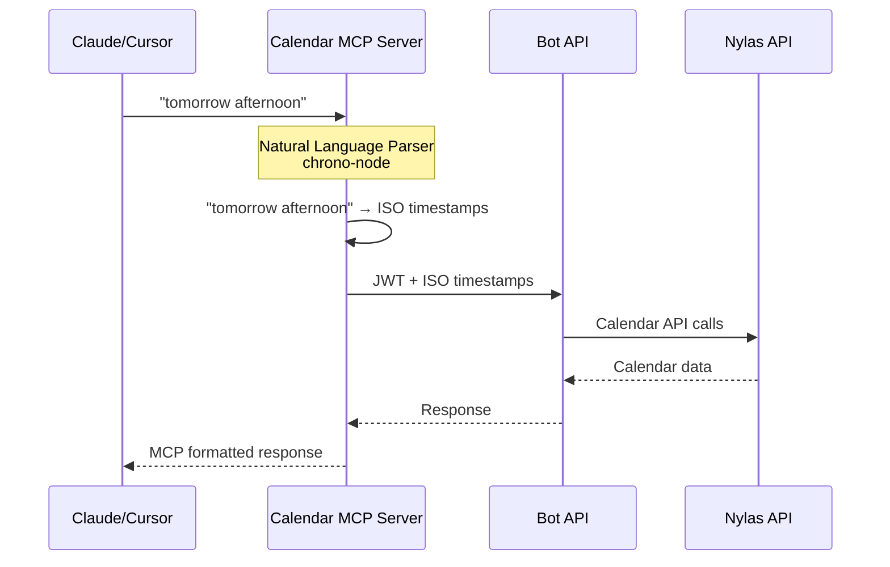

# Nylas Applets Monorepo

A monorepo containing MCP (Model Context Protocol) and Bot API packages for recruiting-focused calendar integrations with **enhanced natural language date parsing**.

## Structure

```
├── packages/
│   ├── bot-api/              # Next.js Edge API for calendar operations
│   ├── calendar-mcp-server/  # 🌟 MCP server with natural language date parsing
│   └── shared-types/         # Shared TypeScript types and interfaces
├── postman/                  # Postman collections for testing
├── pnpm-workspace.yaml       # pnpm workspace configuration
├── package.json              # Root package with shared scripts
└── tsconfig.json             # Root TypeScript configuration
```

## Packages

### [@mcp/bot-api](./packages/bot-api)
A thin, secure façade for recruiting chatbots that provides:
- Hosted Google OAuth via Nylas Connect
- Grant-scoped API keys (JWT)
- Calendar operations proxy to Nylas v3
- Vercel Edge Runtime deployment

### [@mcp/calendar-mcp-server](./packages/calendar-mcp-server) 🌟
An MCP server specifically designed for recruiting workflows with enhanced natural language capabilities:
- **🗣️ Natural Language Date Parsing**: Say "tomorrow afternoon" or "next week" instead of ISO formats
- **🎯 Three Flexible Patterns**: Timeframe, Duration-based, and Precise control
- **🧠 Smart Boundary Inference**: Automatic time boundaries for expressions like "morning" or "week"
- **🚫 Zero LLM Hallucinations**: Server-side date parsing eliminates calculation errors
- **🌍 Automatic Timezone Detection**: Uses your calendar's timezone settings
- **📅 Interview Planning**: Back-to-back session scheduling for interview loops
- **🔐 JWT Authentication**: Integrates with Bot API OAuth flow
- **⚡ Vercel Edge Runtime**: Optimized for low latency

### [@mcp/shared-types](./packages/shared-types)
Shared TypeScript types and interfaces used across packages:
- Grant and authentication types
- API request/response interfaces
- Calendar operation types
- Error codes and responses

## 🌟 Natural Language Date Parsing

The Calendar MCP Server introduces revolutionary natural language date parsing that eliminates LLM hallucinations in date calculations:

### Examples
```typescript
// Instead of calculating ISO dates manually
"start": "2025-01-20T14:00:00", "end": "2025-01-20T15:00:00"

// Just say what you mean
"timeframe": "tomorrow afternoon"        // Auto-infers 1pm-6pm
"timeframe": "next week"                 // Auto-infers Mon 9am - Fri 5pm
"start": "next Monday at 2pm", "duration": "1 hour"  // Server calculates end time
```

### Valid vs Invalid Patterns
⚠️ **IMPORTANT**: Use specific times instead of vague expressions
- ✅ **VALID**: `"tomorrow at 2pm"`, `"next Monday"`, `"January 15th"`, `"in 2 weeks"`, `"Friday at 9 AM"`
- ❌ **INVALID**: `"work hours"`, `"business hours"`, `"lunch time"`

### Supported Expressions
- **Time of Day**: `"morning"`, `"afternoon"`, `"evening"`
- **Relative Days**: `"tomorrow"`, `"next Monday"`, `"this Friday"`
- **Relative Periods**: `"next week"`, `"in 2 weeks"`, `"January 15th"`
- **Durations**: `"1 hour"`, `"30 minutes"`, `"1h30m"`, `"2 hours"`
- **Specific Times**: `"at 2pm"`, `"from 9am to 5pm"`

## Development

### Prerequisites
- Node.js 18+
- pnpm 8+

### Setup

```bash
# Install dependencies for all packages
pnpm install

# Build all packages
pnpm build

# Run linting across all packages
pnpm lint

# Run tests across all packages
pnpm test
```

### Local Development

For local development with Redis and other dependencies:

```bash
# Quick setup (recommended)
./scripts/setup-dev.sh

# Or manual setup:
# 1. Start local dependencies
pnpm dev:deps

# 2. Copy environment templates
cp packages/bot-api/env.local.example packages/bot-api/.env.local
cp packages/calendar-mcp-server/.env.example packages/calendar-mcp-server/.env.local

# 3. Edit .env.local files with your API credentials
# 4. Start development servers
pnpm dev
```

### Development Commands

```bash
# Start all development servers
pnpm dev

# Start specific package
pnpm --filter @mcp/bot-api dev
pnpm --filter @mcp/calendar-mcp-server dev

# Start dependencies (Redis) in background
pnpm dev:deps

# Start dependencies with Redis UI
pnpm dev:deps:ui

# Start everything (dependencies + dev servers)
pnpm dev:full

# View Docker service logs
pnpm dev:logs

# Stop all Docker services
pnpm dev:deps:down
```

### Local Services

When running locally, these services will be available:
- **Bot API**: http://localhost:3000
- **Calendar MCP Server**: http://localhost:3002
- **Redis REST API**: http://localhost:8079
- **Redis UI** (optional): http://localhost:8081

### Working with Individual Packages

```bash
# Run commands in specific package
pnpm --filter @mcp/bot-api dev
pnpm --filter @mcp/calendar-mcp-server dev
pnpm --filter @mcp/shared-types build

# Add dependencies to specific package
pnpm --filter @mcp/calendar-mcp-server add chrono-node
```

### Package Dependencies

The packages have the following dependency relationships:
- `bot-api` depends on `shared-types`
- `calendar-mcp-server` depends on `shared-types`
- `shared-types` is standalone

## Testing

### Postman Collections

Comprehensive Postman collections are available in the `/postman` directory:

```bash
postman/
├── README.md                                          # Testing guide
├── Bot-API.postman_collection.json                    # Bot API with OAuth
├── Calendar-MCP-Server.postman_collection.json       # 🌟 MCP server v0.4
├── Calendar-MCP-Server.postman_environment.json      # Local environment
└── Calendar-MCP-Server-Production.postman_environment.json
```

**🌟 Featured Natural Language Examples**:
- "Tomorrow afternoon" availability checks
- "Next Monday at 2pm" + "1 hour" meeting scheduling
- "Next week" mutual slot finding
- "This Friday" interview loop planning

See [Postman README](./postman/README.md) for detailed testing instructions.

## Deployment

### Bot API
The bot-api package is designed for Vercel Edge Runtime deployment:

1. Connect repository to Vercel
2. Set up Upstash Redis integration
3. Configure environment variables
4. Deploy

### Calendar MCP Server
The calendar-mcp-server package is also designed for Vercel Edge Runtime:

1. Connect repository to Vercel
2. Configure environment variables (BOT_API_URL)
3. Deploy to Vercel Edge Runtime
4. Natural language parsing works identically in production

See individual package READMEs for detailed deployment instructions.

## Architecture

This monorepo follows a modular architecture optimized for recruiting workflows:

1. **Shared Types**: Common interfaces and types
2. **Bot API**: Edge-deployed API facade with OAuth
3. **Calendar MCP Server**: Natural language MCP protocol implementation
4. **Postman Collections**: Comprehensive testing suite

The design allows for:
- **Zero LLM Hallucinations**: Server-side date parsing
- **Type safety**: Across all packages
- **Shared business logic**: Consistent behavior
- **Independent deployment**: Each service can be deployed separately
- **Easy testing**: Comprehensive Postman collections
- **Natural language**: Intuitive date/time expressions

### Calendar MCP Server Integration



## Contributing

1. Make changes in the appropriate package
2. Update shared types if needed
3. Test with Postman collections
4. Run `pnpm build` to ensure everything compiles
5. Run `pnpm lint` to check code style
6. Test your changes with natural language examples

## Environment Variables

Each package may require different environment variables. See individual package READMEs for details:

- [Bot API Environment Variables](./packages/bot-api/README.md#environment-variables)
- [Calendar MCP Server Environment Variables](./packages/calendar-mcp-server/README.md#environment-variables)

## What's New in v0.4

### 🎯 Major Features
- **Natural Language Date Parsing**: Revolutionary server-side parsing with chrono-node
- **Three Flexible Patterns**: Timeframe, Duration-based, and Traditional control
- **Smart Boundary Inference**: Automatic time boundaries for natural expressions
- **Zero LLM Hallucinations**: Eliminates date calculation errors
- **Enhanced Postman Collections**: Comprehensive testing with natural language examples

### 🔧 Technical Improvements
- **Enhanced Error Messages**: Helpful suggestions for ambiguous inputs
- **Duration Support**: Intuitive formats like "1h30m" and "2 hours"
- **Backward Compatibility**: All traditional ISO formats still supported
- **TypeScript Enhancements**: Improved type safety and validation

---

**Version**: 0.4.0  
**Last Updated**: January 2025  
**Node.js**: 18+ required  
**Deployment**: Vercel Edge Runtime optimized 