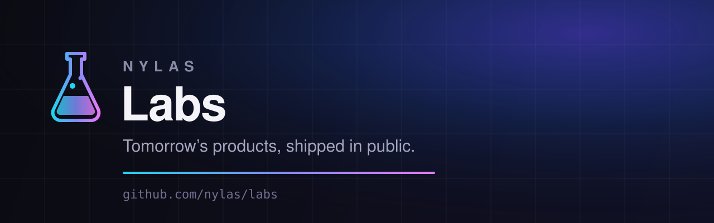
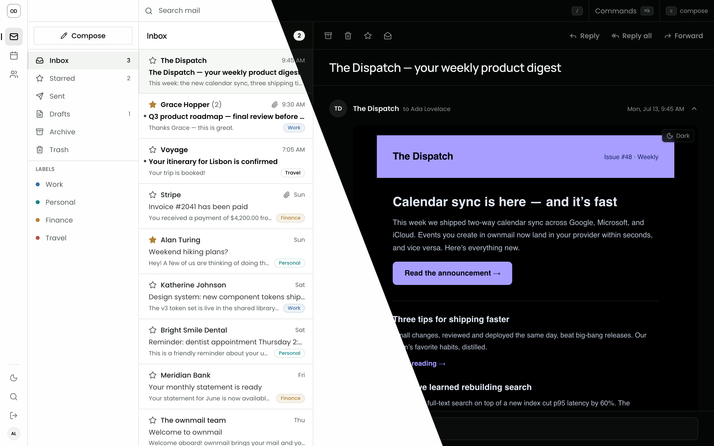

# Nylas Labs

Open-source experiments for developers who would rather build the next thing
than wait for the perfect starting point. Each lab is built on Nylas APIs,
ready to inspect, adapt, and take somewhere interesting.

## Current Projects

| Project | Description | Stage |
|---|---|---|
| [OwnMail](./labs/ownmail) | Put a mailbox and calendar on your own domain, then make it your own | Experiment |

## Give your inbox a home

OwnMail is a self-hosted mailbox and calendar app for independent builders.
Start with a guided Cloudflare, Vercel, Netlify, or local deployment, use your
own domain, and eject the source when you are ready to customize every last
detail.

Start from your terminal:

```bash
npx ownmail
```



See the [OwnMail quickstart](./labs/ownmail/docs/quickstart.md) for the setup
flow, commands, and the power-user `eject` path.

## Repository Layout

```text
shared/            Shared packages used by projects in this repository
labs/<name>/       Individual project source, packages, docs, and README
```

## Get Involved

- Try a project and [start a discussion](https://github.com/nylas/labs/discussions)
- File bugs with the [issue templates](https://github.com/nylas/labs/issues/new/choose)
- Contribute through [CONTRIBUTING.md](./CONTRIBUTING.md)

Labs are experimental and may change without notice. Community feedback helps
decide which ideas continue to develop.

## Development

```bash
pnpm install
pnpm build
pnpm test
pnpm lint
```

Node.js 22.18+ (22.x) or 24.11+, and pnpm 11+ are required.

## Security

Never commit API keys, inbox passwords, session secrets, `.env` files, or other
credentials. Keep deployment secrets in your hosting provider's secret manager
or environment variable system.

## License

[MIT](./LICENSE)
