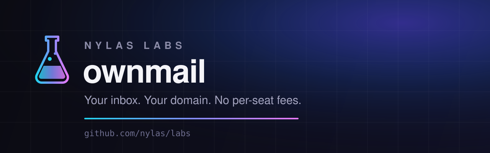

# OwnMail

**Your inbox. Your domain. No per-seat fees.**

> 🧪 **Experiment** — try it, break it, [tell us what you
> think](https://github.com/nylas/labs/discussions). Community traction decides
> whether OwnMail graduates into a fully supported Nylas product.

```bash
npx ownmail
```

One command takes you from nothing to a live, self-hosted mailbox + calendar app on
your own Cloudflare account, powered by [Nylas Agent Accounts](https://developer.nylas.com/docs/v3/agent-accounts/):

1. Sign in (or sign up) to Nylas via browser SSO — no copy-pasting tokens
2. A free sandbox app + API key are provisioned automatically
3. Pick a free `you.nylas.email` subdomain, or bring your own domain
4. Choose your address (`contact@…`) and get a strong inbox password
5. The app deploys to your Cloudflare account (free tier works)
6. Log into your new inbox via Nylas Hosted Auth

Re-run `npx ownmail` any time — every step is resumable and idempotent.

## Packages

| Package | What |
|---|---|
| `packages/cli` (`ownmail` on npm) | The step-machine CLI: provisioning, Cloudflare deploy, update/eject |
| `packages/template` (`@ownmail/template`) | The deployed app: TanStack Start SSR on Cloudflare Workers, Tailwind v4 |

## Architecture notes

- **Auth to Nylas dashboard**: SSO device-authorization flow against
  `dashboard-account` with DPoP-bound (Ed25519) tokens.
- **Apps/keys/grants** go through the dashboard api-gateway GraphQL;
  **domains** go through dashboard-account REST (`/orgs/inbox/domains/*`).
- **End-user login**: Nylas Hosted Auth with `provider=nylas` + PKCE
  (no client secret in the deployed worker).
- **Security invariant**: the deployed app resolves `grant_id` from its
  server-side KV session only — never from client input. Email HTML renders in
  sandboxed iframes.
- **Secrets** (`NYLAS_API_KEY`, `SESSION_SECRET`) exist only as Cloudflare
  Worker secrets; the CLI holds them transiently during a run, then scrubs.

## Status (feature-complete, pre-publish)

Complete: resumable create → deploy step machine; branded + custom domains
(availability check, DNS table, verify polling); update / eject / doctor /
grants / login / destroy / status / inbox add / rotate-key / app-domain
commands; Gmail-style mail (thread list/view, compose with contact
autocomplete, reply, drafts with autosave, search, attachments,
archive/trash/star/unread, quota banners); calendar month/week/day with event
create/edit/delete and RSVP; webhook-backed near-realtime (10s version
polling); **Cloudflare Workers + Vercel build targets** (KV or stateless
signed-cookie sessions); CI per-lab pipelines; developer.nylas.com cookbook
page (branch `ad-TW-5790-ownmail-cookbook`). Tracked under JIRA **TW-5790**.

Awaiting humans: npm publish (no npm credentials on this machine — verified
401), live end-to-end run (needs UAS branch `ps/agent-account-hosted-auth`
deployed + real SSO/Cloudflare accounts), repo push (no git remote configured
yet).

## Platform dependency

End-user login requires the UAS `provider=nylas` hosted-auth screen
(branch `ps/agent-account-hosted-auth`) to be merged and deployed.
