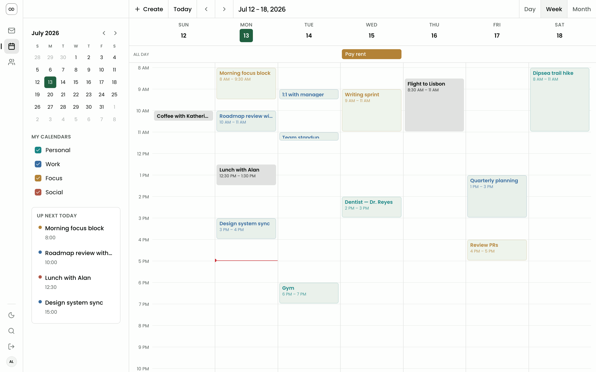
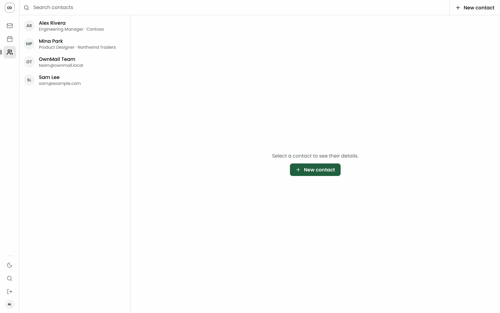

# OwnMail

**Launch an inbox on your domain—with one guided command.**

> Experiment — try it, share feedback, and expect APIs or workflows to change
> while the project develops.

OwnMail creates an email address on a domain you control—or a Nylas-provided
`nylas.email` trial subdomain—and deploys a ready-to-use web app for mail,
calendar, and contacts. Run the app in your Cloudflare, Vercel, or Netlify
account, or on your own machine.

The guided setup handles inbox creation, sign-in configuration, and deployment,
and walks you through DNS when you use your own domain. Nylas hosts the mailbox
service through
[Agent Accounts](https://developer.nylas.com/docs/v3/agent-accounts/); hosted
deployments run in your provider account, and you can export the complete app
source whenever you want to customize it.

**Your email domain. Your app deployment. Your customizable app source.**

## Start with one command

```bash
npx ownmail
```

The setup wizard walks you through sign-in, inbox creation, domain setup, and
deployment. You can re-run the CLI at any time; setup steps are resumable.


## Beyond the inbox

| Calendar | Contacts |
|---|---|
|  |  |

## Know what you control

| You control | OwnMail automates | Nylas provides |
|---|---|---|
| Your email domain and DNS, when you bring one | Email address and app setup | A trial subdomain option, hosted mailbox service, and mail transport |
| Your Cloudflare, Vercel, or Netlify account — or your machine | Sign-in, callback, and deployment configuration | Mail, calendar, and contacts APIs |
| The app source after you export it | A complete codebase ready to customize | The Agent Accounts foundation |

## Export the source and customize

OwnMail is deliberately easy to start and straightforward to outgrow. Copy the
app source into a directory you control whenever you want to tune the UI, add a
feature, or choose a different deployment path:

```bash
ownmail eject ./my-ownmail
```

The ejected project includes the deployable app and its local-development
workflow. You stay in charge of the code from there.

## What you need

- Node.js 22.12+
- A Nylas account
- A Cloudflare, Vercel, or Netlify account if you want hosted deployment
- A domain you control, or a Nylas-provided `nylas.email` trial subdomain

## What gets created

1. A Nylas application and API key for your mailbox app
2. A mailbox address, such as `contact@your-domain.com`
3. A generated inbox password, shown once during setup
4. A Cloudflare Workers, Vercel, Netlify, or loopback-only local web app
5. The required callback and app configuration for sign-in

## Keep building

| Command | What it does |
|---|---|
| `ownmail` | Create or resume an OwnMail deployment |
| `ownmail status` | Show your OwnMail projects |
| `ownmail update` | Redeploy the latest app version |
| `ownmail doctor` | Check configuration and repair common issues |
| `ownmail grants` | List inboxes connected to your Nylas app |
| `ownmail eject [dir]` | Copy the app source into a directory you control and customize it freely |
| `ownmail inbox add` | Add another address on your domain |
| `ownmail inbox reset-password [email]` | Reset an inbox password |
| `ownmail rotate-key` | Rotate the API key used by the app |
| `ownmail app-domain mail.example.com` | Serve the app on your own domain |
| `ownmail destroy` | Remove a Cloudflare deployment without deleting mail data |

## What is in the box

| Package | What it contains |
|---|---|
| `packages/cli` (`ownmail`) | The command-line setup and deployment workflow |
| `packages/app` (`@ownmail/app`) | The mailbox and calendar app deployed by the CLI |

## Security and data handling

- OwnMail supports existing Nylas accounts that use email/password (including
  authenticator-code MFA) and browser-based Google, Microsoft, or GitHub sign-in.
  New Nylas accounts are created through the browser flow. Cloudflare setup
  recommends browser OAuth, with a least-privilege API token available as an
  advanced option.
- Hosted app secrets are stored through the selected provider's secret manager.
  Local runtime secrets stay in the OS credential store and are passed only to
  the loopback server process.
- The deployed app resolves the active inbox from the server-side session,
  not from client-provided identifiers.
- Email HTML is rendered in sandboxed frames.
- Do not commit generated secrets, inbox passwords, `.env` files, or exported
  deployment credentials.

## Choose where it runs

`npx ownmail` offers four guided targets:

- **Cloudflare Workers** — Wrangler deploy with KV-backed sessions and realtime
  webhook refresh.
- **Vercel** — prebuilt Node function deploy with a free Upstash Redis resource
  for durable sessions and realtime webhook refresh.
- **Netlify** — Node function deploy with static assets served from its CDN.
- **Run locally** — production Node build bound only to `localhost`; keep the
  terminal open and press Ctrl+C to stop it.

Netlify and local targets use stateless signed-cookie sessions and poll for new
mail. Cloudflare and Vercel use shared storage plus Nylas webhooks for instant
updates. The CLI registers each resulting callback URL automatically. Provider
CLIs may open a browser the first time you sign in.

## Local development

```bash
pnpm install
pnpm build
pnpm test
pnpm lint
```

Node.js 22.18+ (22.x) or 24.11+, and pnpm 11+ are required.

### Develop the app UI locally

For fast UI work without Nylas credentials, Cloudflare, or a deploy:

```bash
pnpm --filter @ownmail/app dev:ui
```

Open the printed localhost URL and go to `/mail`. This runs the TanStack Start
app with local in-memory mail, draft, contact, and calendar data.

### Refresh the README screenshots

The checked-in product screenshots come from that same local mock UI. Regenerate
the mail light/dark composite and the calendar and contacts captures with:

```bash
pnpm --filter @ownmail/app capture:readme
```

The local UI mock is intentionally limited to the same grant-scoped Nylas v3
resources the app uses in production:

- Mail: threads, messages, drafts, folders, send with small JSON attachments,
  and attachment downloads.
- Calendar: calendars, events, create/update/delete event, and RSVP.
- Contacts: contact lookup for compose autocomplete.
- Realtime refresh: Nylas webhooks in Cloudflare and Vercel deployments; local
  UI mocks, Netlify, and local deployments fall back to navigation/focus refresh.

Those capabilities map to the public
[Nylas API reference](https://developer.nylas.com/docs/reference/api/). Features
outside that wired surface, such as free/busy, availability, scheduling,
notetaker, templates, or workflows, should be proven against `dev:local` before
they are added to the UI.

To test the real hosted-auth and Nylas API flow locally, export the template
environment variables and run the Node SSR target:

```bash
export SESSION_SECRET="..."
export NYLAS_API_KEY="..."
export NYLAS_CLIENT_ID="..."
export NYLAS_REGION="us"
export APP_NAME="ownmail-local"
export OWNMAIL_SITE_NAME="My Mail"
export INBOX_EMAIL="you@example.com"
export TEMPLATE_VERSION="0.1.2"
pnpm --filter @ownmail/app dev:local
```

Register `http://localhost:5173/auth/callback` as a callback URI on the Nylas
application before using `dev:local`.
