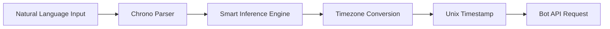

# Calendar MCP Server - API Contracts & Separation of Concerns

## 🎯 Overview

This document defines the clear API contracts and separation of concerns between:
- **MCP Client** (Cursor/Claude) ↔ **Calendar MCP Server**
- **Calendar MCP Server** ↔ **Bot API**

## 🤖 LLM Compatibility & Null Handling (v0.4.1)

### Enhanced LLM Support
This version includes significant improvements for LLM compatibility:

- ✅ **Null Value Normalization**: Automatically converts `null` values to `undefined` before validation
- ✅ **Flexible Input Patterns**: Accepts partial information and infers missing data intelligently  
- ✅ **Smart End Time Inference**: When only `start` is provided, automatically infers reasonable end time
- ✅ **Improved Error Messages**: More descriptive validation errors to guide LLMs

### Null Handling Examples

```typescript
// ❌ Previously failed (before v0.4.1)
{
  "tool": "my_availability",
  "arguments": {
    "start": "2025-06-12T09:00:00",
    "end": null,                     // LLMs often send null instead of omitting
    "timezone": "America/Toronto"
  }
}

// ✅ Now succeeds (v0.4.1+) - null converted to undefined, end time inferred
// Server response includes inferred end time (e.g., 5 PM same day or start + 8 hours)

// ✅ Partial information now supported
{
  "tool": "my_availability", 
  "arguments": {
    "start": "2025-06-12T09:00:00",  // Only start provided
    "timezone": "America/Toronto"     // End time automatically inferred
  }
}
```

### Smart Inference Rules

When only `start` time is provided:
- **Morning/Afternoon start (before 2 PM)**: Infer end as 5 PM same day
- **Evening start (after 2 PM)**: Infer end as start + 8 hours
- **All inferences respect timezone**: Calculations performed in user's timezone

## 🏗 Architecture & Separation of Concerns

### Calendar MCP Server Responsibilities
- ✅ **User-Facing API**: Handles MCP protocol communications
- ✅ **Natural Language Processing**: Parses human-friendly date expressions 
- ✅ **Input Validation**: Validates multiple input patterns and formats
- ✅ **Data Transformation**: Converts natural language → internal API formats
- ✅ **Response Transformation**: Converts unix timestamps → LLM-friendly ISO format with timezone info
- ✅ **Error Handling**: Provides clear error messages with suggestions
- ✅ **Authentication**: Validates JWT tokens and passes them to Bot API

### Bot API Responsibilities  
- ✅ **Nylas Integration**: Direct communication with Nylas API
- ✅ **Authentication**: JWT token validation and user context
- ✅ **Calendar Operations**: Raw calendar operations (availability, events)
- ✅ **Data Processing**: Processes responses from Nylas for return to MCP Server

## 📋 Enhanced API Contracts (v0.4)

### 1. MCP Client → Calendar MCP Server (User-Facing)

**Enhanced Format**: Multiple input patterns supported - natural language, durations, and ISO
**Authentication**: JWT Bearer token in Authorization header

#### Available Tools with Enhanced Input Patterns

##### Pattern 1: Simple Timeframe (Recommended) 🌟

```typescript
// Get my availability - Timeframe pattern
{
  "tool": "my_availability",
  "arguments": {
    "timeframe": "next week",        // Natural language timeframe
    "timezone": "America/New_York",  // Optional, auto-detected if omitted
    "bufferMinutes": 15              // Optional buffer around meetings
  }
}

// Find mutual slots - Timeframe pattern  
{
  "tool": "mutual_slots",
  "arguments": {
    "emails": ["user1@example.com", "user2@example.com"],
    "timeframe": "tomorrow afternoon",  // Smart boundary inference
    "durationMin": 60,
    "bufferMinutes": 15
  }
}

// Interview scheduling - Timeframe pattern
{
  "tool": "consecutive_slots",
  "arguments": {
    "sessions": [
      {"label": "HR", "emails": ["hr@example.com"], "durationMin": 30},
      {"label": "Technical", "emails": ["tech@example.com"], "durationMin": 60}
    ],
    "timeframe": "this Friday",      // Auto-infers business day boundaries
    "gapMaxMin": 15
  }
}
```

##### Pattern 2: Schedule Meeting with Start and End Times

```typescript
// Schedule meeting - Start and End pattern (both required)
{
  "tool": "schedule_meeting",
  "arguments": {
    "emails": ["attendee@example.com"],
    "start": "tomorrow at 2pm",       // Natural language start time
    "end": "tomorrow at 3pm",         // Natural language end time (required)
    "title": "Project sync",
    "description": "Weekly team sync to discuss project progress and blockers",
    "addSelf": true
  }
}

// Note: The server validates that the meeting duration does not exceed a configurable maximum (default: 12 hours). If the duration is too long, a clear error message is returned for both LLMs and humans. All date parsing is performed in the user's specified timezone (e.g., America/Toronto).

// Alternative format with mixed natural language and ISO
{
  "start": "next Monday at 10:30am",
  "end": "next Monday at 11:30am"     // Both start and end required
}

{
  "start": "January 15th at 9am", 
  "end": "January 15th at 10am"      // Explicit end time required
}
```

##### Pattern 3: Precise Start/End Control (Legacy Compatible)

```typescript
// Traditional ISO format - Still fully supported
{
  "tool": "my_availability",
  "arguments": {
    "start": "2025-01-20T09:00:00",   // ISO datetime
    "end": "2025-01-20T17:00:00",     // ISO datetime  
    "timezone": "America/New_York"
  }
}

// Mixed natural language and ISO
{
  "tool": "contact_availability",
  "arguments": {
    "email": "user@example.com",
    "start": "tomorrow morning",       // Natural language
    "end": "2025-01-21T12:00:00",     // ISO format
    "timezone": "America/New_York"
  }
}
```

#### Natural Language Expression Examples

| Expression | Smart Inference |
|------------|-----------------|
| `"tomorrow morning"` | Tomorrow 8am → Tomorrow 12pm |
| `"next week"` | Next Monday 9am → Next Friday 5pm |
| `"this Friday"` | This Friday 9am → This Friday 5pm |
| `"January 15th"` | Jan 15 9am → Jan 15 5pm |
| `"next Monday afternoon"` | Next Monday 1pm → Next Monday 6pm |
| `"tomorrow from 9am to 5pm"` | Explicit range preserved |
| `"in 2 weeks"` | Two weeks from today (business day) |


#### Complete Tool Definitions

```typescript
// Enhanced my_availability tool
{
  "tool": "my_availability",
  "arguments": {
    // Option 1: Timeframe (recommended)
    "timeframe": "next week",         // Natural language timeframe
    
    // Option 2: Separate start/end (precise control)
    "start": "tomorrow morning",      // Natural language or ISO
    "end": "tomorrow at noon",        // Natural language or ISO
    
    // Common options
    "timezone": "America/New_York",   // Optional, auto-detected
    "bufferMinutes": 15               // Optional meeting buffer
  }
}

// Enhanced contact_availability tool  
{
  "tool": "contact_availability",
  "arguments": {
    "email": "user@example.com",      // Required contact email
    
    // Option 1: Timeframe (recommended)  
    "timeframe": "this Friday",       // Natural language timeframe
    
    // Option 2: Separate start/end (precise control)
    "start": "2025-01-20",           // Natural language or ISO
    "end": "2025-01-20T17:00",       // Natural language or ISO
    
    "timezone": "America/New_York",   // Optional
    "bufferMinutes": 15               // Optional
  }
}

// Enhanced mutual_slots tool
{
  "tool": "mutual_slots", 
  "arguments": {
    "emails": ["user1@example.com", "user2@example.com"],  // Required
    
    // Option 1: Timeframe (recommended)
    "timeframe": "next week",         // Natural language timeframe
    
    // Option 2: Separate start/end (precise control)  
    "start": "2025-01-20",           // Natural language or ISO
    "end": "2025-01-26",             // Natural language or ISO
    
    "durationMin": 60,                // Required meeting duration
    "timezone": "America/New_York",   // Optional
    "bufferMinutes": 15               // Optional
  }
}

// Enhanced schedule_meeting tool
{
  "tool": "schedule_meeting",
  "arguments": {
    "emails": ["attendee@example.com"],     // Required attendees
    "title": "Team Meeting",                // Required meeting title
    "description": "Weekly team sync to discuss project progress and blockers", // Optional description
    
    // Both start and end are required
    "start": "tomorrow at 2pm",            // Natural language or ISO (required)
    "end": "tomorrow at 3pm",              // Natural language or ISO (required)
    
    "timezone": "America/New_York",        // Optional
    "addSelf": true                        // Optional, default true
  }
}

// Enhanced consecutive_slots tool
{
  "tool": "consecutive_slots",
  "arguments": {
    "sessions": [                          // Required interview sessions
      {
        "label": "HR Interview",
        "emails": ["hr@example.com"],
        "durationMin": 30
      },
      {
        "label": "Technical Interview",
        "emails": ["tech@example.com"], 
        "durationMin": 60
      }
    ],
    
    // Option 1: Timeframe (recommended)
    "timeframe": "this Friday",            // Natural language timeframe
    
    // Option 2: Separate start/end (precise control)
    "start": "2025-01-20",                // Natural language or ISO
    "end": "2025-01-20",                  // Natural language or ISO
    
    "gapMaxMin": 15,                      // Required max gap between sessions
    "timezone": "America/New_York"        // Optional
  }
}

// Utility tools (unchanged)
{
  "tool": "current_time", 
  "arguments": {
    "timezone": "America/New_York"        // Required timezone
  }
}

{
  "tool": "user_info",
  "arguments": {}                         // No parameters needed
}
```

#### Enhanced Input Validation Rules

| Field | Type | Format Options | Validation |
|-------|------|---------------|------------|
| `timeframe` | string | `"next week"`, `"tomorrow afternoon"` | Natural language expressions |
| `start` | string | `"tomorrow at 2pm"` or `"2025-06-09T12:00"` | Natural language or ISO |
| `end` | string | `"tomorrow at 5pm"` or `"2025-06-09T18:00"` | Natural language or ISO |
| `duration` | string | `"1 hour"`, `"30 minutes"`, `"1h30m"` | Duration expressions |
| `email` | string | `"user@domain.com"` | Valid email format |
| `emails` | array | `["email1", "email2"]` | Array of valid emails |
| `durationMin` | number | `30` | Positive integer |
| `title` | string | `"Meeting Title"` | Non-empty string |
| `description` | string | `"Meeting details and agenda"` | Optional meeting description |
| `timezone` | string | `"America/New_York"` | Valid timezone identifier |

#### 🌟 LLM-Friendly Response Format (v0.4)

**Major Improvement**: All responses now use human-readable ISO format with timezone information instead of unix timestamps. This enables LLMs to work with date/time data without additional tooling.

**Benefits for LLMs**:
- ✅ **Direct Date Understanding**: No need for timestamp conversion tools
- ✅ **Timezone Awareness**: Includes timezone offset information (e.g., `-05:00`)  
- ✅ **Human Readable**: LLMs can understand "2025-01-20T14:00:00-05:00" natively
- ✅ **Consistent Format**: All date/time fields use the same ISO format
- ✅ **Zero Hallucinations**: No risk of LLM miscalculating unix timestamp conversions

**Before (Unix Timestamps)**:
```json
{"start_time": 1737383200, "end_time": 1737386800}  // ❌ LLM cannot interpret
```

**After (LLM-Friendly)**:
```json
{"start": "2025-01-20T14:00:00-05:00", "end": "2025-01-20T15:00:00-05:00"}  // ✅ LLM understands
```

```typescript
// Availability responses - NEW FORMAT
{
  "time_slots": [
    {
      "start": "2025-01-20T09:00:00-05:00",  // ISO with timezone offset
      "end": "2025-01-20T09:30:00-05:00"     // ISO with timezone offset
    }
  ]
}

// Event creation response - NEW FORMAT
{
  "id": "event_12345",
  "status": "confirmed", 
  "title": "Team Meeting",
  "description": "Weekly team sync to discuss project progress",
  "start": "2025-01-20T14:00:00-05:00",      // Replaces unix timestamps
  "end": "2025-01-20T15:00:00-05:00"        // Includes user timezone info
}

// Current time response
{
  "currentDate": "2025-01-20",
  "currentTime": "14:30",
  "currentDateTime": "2025-01-20T14:30", 
  "isoString": "2025-01-20T19:30:00.000Z",
  "dayOfWeek": "Monday",
  "timezone": "America/New_York",
  "message": "Current time in America/New_York: Monday, 2025-01-20T14:30"
}

// User info response
{
  "grant_id": "grant_abc123",
  "email": "user@example.com",
  "provider": "google", 
  "org_id": "your_org_id",
  "timezone": "America/New_York",
  "message": "Authenticated user: user@example.com (google) in timezone America/New_York"
}
```

#### Enhanced Error Handling

```typescript
// Date parsing error
{
  "error": "date_parse_error",
  "message": "Unable to parse timeframe: 'sometime next'. Please use natural language like 'next week', 'tomorrow afternoon', 'next Monday', or ISO format like '2025-06-09T14:00'",
  "suggestions": ["next week", "next Monday", "tomorrow morning"]
}

// Validation error
{
  "error": "invalid_params", 
  "message": "Must provide either 'timeframe' OR both 'start' and 'end'",
  "field": "timeframe"
}

// Duration parsing error
{
  "error": "duration_parse_error",
  "message": "Unable to parse duration: 'some time'. Please use formats like '1 hour', '30 minutes', '1h30m'",
  "suggestions": ["1 hour", "30 minutes", "45min"]
}
```

### 2. Calendar MCP Server → Bot API (Internal)

**Format**: Internal API optimized, Unix timestamps (unchanged)
**Authentication**: JWT Bearer token forwarded from MCP client

#### Date Processing Pipeline



The MCP Server now performs sophisticated date processing:

1. **Input Detection**: Determines which pattern (timeframe, start+duration, start+end)
2. **Natural Language Parsing**: Uses chrono-node for robust parsing
3. **Smart Inference**: Applies business logic for boundary detection
4. **Timezone Handling**: Respects user timezone for all calculations  
5. **Transformation**: Converts to Unix timestamps for Bot API

#### Transformed Requests (Internal)

```typescript
// Availability request (internal) 
{
  "start_time": 1737369600,      // Unix timestamp (from parsed natural language)
  "end_time": 1737456000,        // Unix timestamp (from smart inference)
  "duration_minutes": 30,
  "participants": [               // Only if specific participants
    { "email": "user@example.com" }
  ]
}

// Event creation request (internal)
{
  "title": "Team Meeting",
  "when": {
    "start_time": 1737383200,    // Unix timestamp (from "tomorrow at 2pm")
    "end_time": 1737386800       // Unix timestamp (from start + "1 hour")
  },
  "participants": [
    { "email": "attendee@example.com" }
  ]
}
```

#### Bot API Endpoints

| Endpoint | Method | Purpose |
|----------|--------|---------|
| `/api/proxy/calendars/availability` | POST | Get availability/mutual slots |
| `/api/proxy/events` | POST | Create calendar events |
| `/api/health` | GET | Health check |

## 🔧 Data Transformation Pipeline

### User Input → Bot API Request

```typescript
// 1. User Input (MCP Client)
{
  "start": "2025-01-20",
  "end": "2025-01-26",
  "emails": ["user@example.com"],
  "durationMin": 30
}

// 2. Validation (Calendar MCP Server)
validateMcpRequest('mutual_slots', userInput)

// 3. Transformation (Calendar MCP Server)  
{
  "start_time": 1737369600,      // Converted to Unix
  "end_time": 1737456000,        // Converted to Unix
  "duration_minutes": 30,
  "participants": [
    { "email": "user@example.com" }
  ]
}

// 4. Bot API Call (Calendar MCP Server → Bot API)
POST /api/proxy/calendars/availability

// 5. Response Processing (Calendar MCP Server)
// Bot API returns ISO strings, passed through to user
```

## 🚨 Error Handling

### Validation Errors (400)
```json
{
  "error": "validation_failed",
  "errors": [
    {
      "field": "range",
      "message": "Date range must be in format YYYY-MM-DD/YYYY-MM-DD"
    }
  ]
}
```

### Authentication Errors (401)
```json
{
  "error": "unauthorized", 
  "description": "Invalid or expired JWT token"
}
```

### Downstream Errors (502)
```json
{
  "error": "downstream_failure",
  "description": "Bot API returned error: 400 Invalid participant"
}
```

## 📚 Usage Examples

### Complete Flow Example

1. **MCP Client sends request:**
```json
{
  "tool": "mutual_slots",
  "arguments": {
    "emails": ["colleague@example.com"],
    "range": "2025-01-20/2025-01-21", 
    "durationMin": 60
  }
}
```

2. **Calendar MCP Server validates & transforms:**
```typescript
// Validation
validateMcpRequest('mutual_slots', arguments) // ✅ Pass

// Transformation  
const botRequest = {
  start_time: 1737369600,
  end_time: 1737456000,
  duration_minutes: 60,
  participants: [{ email: "colleague@example.com" }]
}
```

3. **Bot API processes & returns:**
```json
{
  "time_slots": [
    {
      "start": "2025-01-20T14:00:00Z",
      "end": "2025-01-20T15:00:00Z"
    }
  ]
}
```

4. **MCP Client receives user-friendly response:**
```json
{
  "content": [
    {
      "type": "text", 
      "text": "{\"time_slots\":[{\"start\":\"2025-01-20T14:00:00Z\",\"end\":\"2025-01-20T15:00:00Z\"}]}"
    }
  ]
}
```

## 🔍 Debugging Tips

### Check Authentication
```bash
curl -H "Authorization: Bearer YOUR_JWT_TOKEN" \
     http://localhost:3002/mcp \
     -X POST \
     -H "Content-Type: application/json" \
     -d '{"jsonrpc":"2.0","method":"tools/list","id":1}'
```

### Test Bot API Connection
```bash
curl -H "Authorization: Bearer YOUR_JWT_TOKEN" \
     http://localhost:3001/api/health
```

### Validate Date Range Format
```typescript
// ✅ Valid formats
"2025-01-20/2025-01-26"           // Date range
"2025-01-20T09:00/2025-01-20T17:00"  // Datetime range

// ❌ Invalid formats  
"01/20/2025"                      // Wrong format
"2025-01-20"                      // Missing end date
"2025-01-26/2025-01-20"          // End before start
```

## 🎯 Key Benefits

### Clear Separation
- **User Experience**: MCP clients use friendly ISO dates
- **Performance**: Bot API uses efficient Unix timestamps  
- **Maintainability**: Single transformation layer

### Type Safety
- **Compile-time validation** with TypeScript interfaces
- **Runtime validation** with Zod schemas
- **Clear error messages** for debugging

### Scalability
- **Independent scaling** of MCP Server and Bot API
- **Clear interfaces** enable easy testing and mocking
- **Extensible design** for adding new calendar operations 

#### 🌍 Automatic Timezone Detection

**New Feature**: All tools now support automatic timezone detection from the user's primary calendar.

**Timezone Parameter Behavior**:
- **Optional**: The `timezone` parameter is now optional for all tools
- **Auto-Detection**: If not provided, the system fetches the user's primary calendar timezone from Nylas
- **Override**: Users can still provide an explicit timezone to override auto-detection
- **Priority Order**:
  1. Explicit `timezone` parameter (if provided)
  2. HTTP headers (`X-User-Timezone`, `X-Timezone`, `Timezone`)
  3. Primary calendar timezone (automatically fetched from Nylas API)
  4. Error message (if none of the above work)

#### Updated Tool Descriptions

All calendar tools now include automatic timezone detection:
- `my_availability`: "Timezone is automatically detected from your calendar settings, or can be overridden explicitly"
- `contact_availability`: "Timezone is automatically detected from your calendar settings, or can be overridden explicitly"  
- `mutual_slots`: "Timezone is automatically detected from your calendar settings, or can be overridden explicitly"
- `schedule_meeting`: "Timezone is automatically detected from your calendar settings, or can be overridden explicitly"
- `consecutive_slots`: "Timezone is automatically detected from your calendar settings, or can be overridden explicitly" 