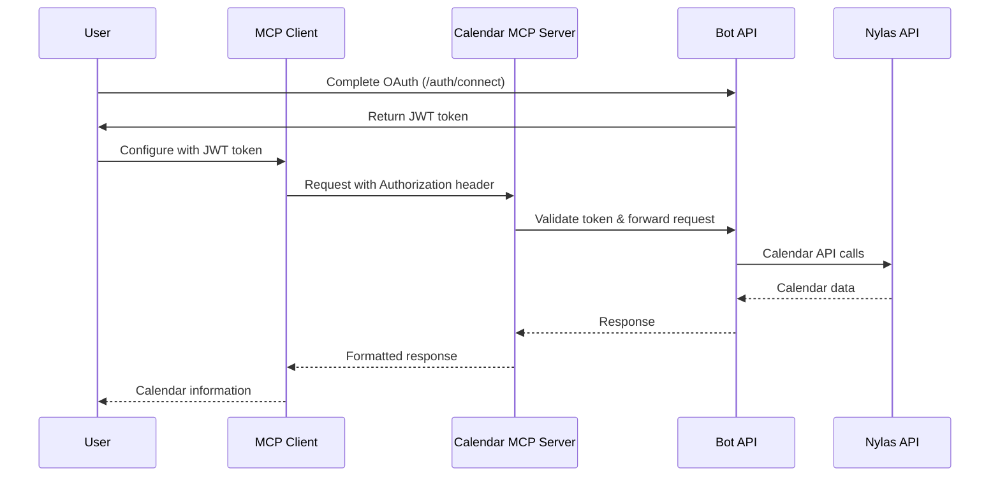

# Calendar MCP Server

A Model Context Protocol (MCP) server for calendar operations, built with Next.js and Vercel Edge Runtime.

## Overview

This MCP server provides calendar-centric actions for recruiting chatbots and AI assistants. It exposes calendar operations through the MCP protocol and delegates heavy lifting to the existing Bot API.

## 🎯 Key Features

- **🗣️ Natural Language Date Parsing**: Say "tomorrow afternoon" or "next week" instead of complex ISO formats
- **⏰ Future-Looking by Default**: Only future availability returned unless explicitly requested (eliminates past time confusion)
- **🚀 Calendar Actions**: Check availability, find mutual slots, schedule meetings
- **⚡ Edge Runtime**: Optimized for low latency with Vercel Edge
- **📡 Streaming Responses**: Sub-150ms latency for real-time AI interactions  
- **🔐 Multi-tenant Support**: JWT authentication per user via Bot API OAuth
- **📅 Interview Planning**: Back-to-back session scheduling for interview loops
- **🌍 Smart Timezone Handling**: Automatic timezone detection from your calendar

## 🌟 Natural Language Date Parsing (v0.4)

**NEW**: The MCP server now understands natural language for dates and times, eliminating LLM hallucinations in date calculations!

### Three Flexible Input Patterns

#### Pattern 1: Simple Timeframe (Recommended) 🎯
```json
{
  "timeframe": "next week",
  "timezone": "America/New_York"
}
```

**Examples**:
- `"tomorrow afternoon"` → Tomorrow 1pm-6pm
- `"next week"` → Next Monday 9am - Next Friday 5pm
- `"this Friday"` → This Friday 9am-5pm
- `"January 15th"` → Jan 15 9am-5pm

#### Pattern 2: Duration-Based Scheduling ⏰
```json
{
  "start": "tomorrow at 2pm",
  "duration": "1 hour"
}
```

**Examples**:
- `start: "next Monday at 10am", duration: "30 minutes"`
- `start: "tomorrow afternoon", duration: "1h30m"`
- `start: "Friday at 2pm", duration: "2 hours"`

#### Pattern 3: Precise Control (Legacy Compatible) 🎛️
```json
{
  "start": "2025-01-20T14:00:00",
  "end": "2025-01-20T15:00:00"
}
```

Still fully supports ISO format and mixed approaches!

### Smart Boundary Inference

The system automatically infers sensible time boundaries:

| Expression | Smart Boundary |
|------------|----------------|
| "tomorrow morning" | 8am → 12pm |
| "next week" | Monday 9am → Friday 5pm |  
| "this Friday" | Friday 9am → 5pm |
| "next Monday afternoon" | Monday 1pm → 6pm |

### Duration Formats Supported

- `"1 hour"`, `"30 minutes"`, `"2 hours"`
- `"1h30m"`, `"45min"`, `"2h"`
- Flexible expressions like `"an hour"`, `"half an hour"`

## ⏰ Future-Looking Filtering (v0.5)

**NEW**: By default, all availability tools now return only future time slots, eliminating confusion from past times that can't be scheduled.

### Default Behavior

**All availability tools filter out past times by default**:
- `my_availability` - Shows only future availability 
- `contact_availability` - Shows only future availability
- `mutual_slots` - Shows only future mutual slots
- `consecutive_slots` - Plans only future interview sessions

### Smart Filtering

The system applies **time slot level filtering** for maximum accuracy:

```typescript
// If it's Wednesday and you ask for "this week"
{
  "tool": "my_availability",
  "arguments": {
    "timeframe": "this week"
  }
}

// Response includes helpful filtering info
{
  "time_slots": [
    {"start": "2025-01-16T09:00", "end": "2025-01-16T10:00"}, // Thursday
    {"start": "2025-01-17T14:00", "end": "2025-01-17T15:00"}  // Friday
  ],
  "filtering_info": {
    "past_slots_filtered": 3,
    "filtering_applied": true,
    "message": "⏰ Filtered 3 past time slots (showing only future availability). Use 'includePast: true' to include past times."
  }
}
```

### Override with `includePast`

When you need past times (for analysis, debugging, etc.):

```typescript
{
  "tool": "my_availability", 
  "arguments": {
    "timeframe": "this week",
    "includePast": true  // Include Monday-Wednesday slots
  }
}
```

### Time Range Adjustment

If your requested range starts in the past, it's automatically adjusted:

```typescript
// If you ask for "yesterday to tomorrow" (and it's Wednesday)
{
  "time_slots": [...], // Only Wednesday-Thursday slots
  "filtering_info": {
    "message": "⏰ Adjusted start time from past to present (2025-01-15T10:30). Use 'includePast: true' to include past times."
  }
}
```

### Benefits for LLMs

- **No Date Confusion**: LLMs can't accidentally suggest past meeting times
- **Clear Communication**: Filtering messages help LLMs understand what happened
- **Preserved Intent**: Partial ranges are kept (Wed-Fri from "this week" when it's Wednesday)
- **Explicit Control**: Use `includePast: true` when past data is actually needed

## Available Tools

| Tool | Description | Enhanced Parameters |
|------|-------------|-------------------|
| `my_availability` | Get my primary calendar free-busy | `{ timeframe?, start?, end?, durationMin?, timezone?, bufferMinutes?, includePast? }` |
| `contact_availability` | Get contact's availability | `{ email, timeframe?, start?, end?, durationMin?, timezone?, bufferMinutes?, includePast? }` |
| `mutual_slots` | Find mutual availability slots | `{ emails[], timeframe?, start?, end?, durationMin, timezone?, bufferMinutes?, includePast? }` |
| `schedule_meeting` | Create meeting with participants | `{ emails[], start, end, title, description?, timezone?, addSelf? }` |
| `consecutive_slots` | Plan back-to-back interview sessions | `{ sessions[], timeframe?, start?, end?, gapMaxMin, timezone?, includePast? }` |
| `current_time` | Get current date and time | `{ timezone }` |
| `user_info` | Get current user information (email, timezone, etc.) | `{}` |

## 🕒 Timezone Handling and Meeting Duration Validation

- All natural language date parsing (e.g., "today at 5:15 pm") is performed in the user's specified timezone (e.g., America/Toronto). If no timezone is provided, the server will attempt to infer it from your calendar or request headers.
- For the `schedule_meeting` tool, the server validates that the meeting duration does not exceed a configurable maximum (default: 12 hours). If the duration is too long, a clear error message is returned for both LLMs and humans:

  > The meeting duration is unusually long (over 12 hours). Please check your start and end times, or specify a shorter meeting. If you intended a long meeting, ask your admin to increase the maximum allowed duration.

- The maximum allowed duration can be configured via the `MCP_MAX_MEETING_DURATION_HOURS` environment variable.

## 🚀 Usage Examples

### Natural Language Examples

```typescript
// Check my availability tomorrow afternoon (future-only by default)
{
  "tool": "my_availability",
  "arguments": {
    "timeframe": "tomorrow afternoon"
  }
}

// Schedule a meeting next Monday 2pm-3pm (always future)
{
  "tool": "schedule_meeting", 
  "arguments": {
    "emails": ["colleague@company.com"],
    "start": "next Monday at 2pm",
    "end": "next Monday at 3pm",
    "title": "Project sync",
    "description": "Weekly team sync to discuss project progress and blockers"
  }
}

// Find 30-minute slots next week for multiple people (future-only)
{
  "tool": "mutual_slots",
  "arguments": {
    "emails": ["person1@company.com", "person2@company.com"],
    "timeframe": "next week",
    "durationMin": 30
  }
}

// Plan interview sessions for this Friday (future-only)
{
  "tool": "consecutive_slots",
  "arguments": {
    "sessions": [
      {"label": "HR Interview", "emails": ["hr@company.com"], "durationMin": 30},
      {"label": "Technical", "emails": ["tech@company.com"], "durationMin": 60}
    ],
    "timeframe": "this Friday"
  }
}

// Include past times when needed (for analysis/debugging)
{
  "tool": "my_availability",
  "arguments": {
    "timeframe": "this week",
    "includePast": true  // Shows Monday-Friday even if it's Wednesday
  }
}
```

### Conversation Examples

**Human**: "What's my availability tomorrow afternoon?"

**AI Response**: Using natural language parsing, checking tomorrow 1pm-6pm...
- ✅ Available: Tomorrow 1:00pm - 3:00pm
- ❌ Busy: Tomorrow 3:00pm - 4:00pm (Team standup)
- ✅ Available: Tomorrow 4:00pm - 6:00pm

**Human**: "What's my availability this week?"

**AI Response**: Checking this week's availability (Monday 9am - Friday 5pm)...
⏰ *Note: Filtered 3 past time slots from Monday-Tuesday (showing only future availability)*
- ✅ Available: Today 2:00pm - 5:00pm
- ✅ Available: Tomorrow 9:00am - 12:00pm
- ❌ Busy: Tomorrow 2:00pm - 3:00pm (Client call)
- ✅ Available: Friday 10:00am - 4:00pm

**Human**: "Schedule a meeting with John next Monday at 2pm to 3pm"

**AI Response**: Scheduling meeting with john@company.com...
- 📅 **Meeting Created**: "Discussion with John"
- 🕐 **Time**: Next Monday, 2:00pm - 3:00pm (America/New_York)
- ✅ **Status**: Confirmed, calendar invites sent

## 🌍 Automatic Timezone Detection

**Enhanced Feature**: The Calendar MCP server now automatically detects your timezone from your calendar settings! 

### How It Works

1. **Automatic Detection**: When you don't specify a timezone, the system fetches your primary calendar's timezone from Nylas
2. **Seamless Experience**: No more need to constantly specify your timezone in requests
3. **Override Capability**: You can still explicitly provide a timezone to override the automatic detection
4. **Fallback Behavior**: If timezone detection fails, the system provides a clear error message

### Timezone Priority

The system uses this priority order for timezone detection:

1. ✅ **Explicit timezone parameter** (if provided in the request)
2. ✅ **HTTP headers** (custom timezone headers from MCP client)
3. 🆕 **Calendar timezone** (automatically fetched from your Nylas calendar)
4. ⚠️ **Error message** (if none of the above work)

### Benefits for AI Assistants

- **Zero Hallucinations**: Server-side date parsing eliminates LLM calculation errors
- **Faster interactions**: AI assistants don't need to ask for your timezone repeatedly
- **Better user experience**: Calendar operations "just work" in your local timezone
- **Natural communication**: Use phrases like "tomorrow morning" or "next week"
- **Accurate scheduling**: All times are automatically converted to your preferred timezone
- **Transparency**: Use the `user_info` tool to see what timezone is being used

## Authentication 🔐

**Updated Implementation**: The Calendar MCP server now integrates with the **Bot API's existing OAuth flow** to provide proper user authentication.

### How Users Get Their JWT Token

1. **OAuth Authentication via Bot API**: Users must first complete OAuth authentication through the Bot API
2. **Get Token**: After successful OAuth, users receive a JWT token from the Bot API's `/auth/callback` endpoint
3. **Configure MCP Client**: Users provide their JWT token in their MCP client configuration

### OAuth Flow Steps

1. **Visit Bot API OAuth**: Navigate to the Bot API OAuth endpoint (e.g., `http://localhost:3000/auth/connect`)
2. **Complete Google OAuth**: Authenticate with Google Calendar via Nylas
3. **Receive JWT Token**: The `/auth/callback` endpoint returns a response like:
   ```json
   {
     "success": true,
     "data": {
       "grant_id": "grant_abc123",
       "api_key": "eyJhbGciOiJIUzI1NiIsInR5cCI6IkpXVCJ9...",
       "org_id": "your_org_id",
       "provider": "google"
     }
   }
   ```
4. **Use API Key**: The `api_key` field contains your personal JWT token

### MCP Client Configuration

#### Claude Desktop

Using `mcp-remote` (install globally first: `npm install -g mcp-remote`):

```json
{
  "mcpServers": {
    "calendar": {
      "command": "npx",
      "args": [
        "mcp-remote",
        "http://localhost:3002/mcp",
        "--header",
        "Authorization: Bearer ${CALENDAR_JWT_TOKEN}"
      ],
      "env": {
        "CALENDAR_JWT_TOKEN": "YOUR_JWT_TOKEN_HERE"
      }
    }
  }
}
```

#### Cursor

```json
{
  "mcpServers": {
    "calendar": {
      "url": "http://localhost:3002/mcp",
      "headers": {
        "Authorization": "Bearer YOUR_JWT_TOKEN_HERE"
      }
    }
  }
}
```

### Security Features

- **Per-User Authentication**: Each user has their own JWT token tied to their OAuth grant
- **Token Validation**: All requests validate JWT tokens against the Bot API's Redis store
- **Multi-Tenant Isolation**: Users can only access their own calendar data
- **Token Revocation**: Tokens can be revoked via the Bot API key management
- **Secure Pass-Through**: MCP server forwards user JWTs to Bot API for authorization

### Development vs Production

**Development**: 
- Users authenticate via local Bot API (`http://localhost:3000/auth/connect`)
- Test with personal Google Calendar accounts
- JWT tokens are valid for 90 days by default

**Production**:
- Users authenticate via production Bot API
- OAuth redirects to production callback URLs
- Enterprise-grade token management via Redis
- Configurable token expiration

## Environment Variables

```bash
# Bot API connection (required)
BOT_API_URL=http://localhost:3001

# Next.js configuration
NEXT_PUBLIC_APP_URL=http://localhost:3002
```

## API Endpoints

- `POST /mcp` - Main MCP endpoint (requires JWT authentication)
- `POST /sse` - SSE transport endpoint (requires JWT authentication)  
- `GET /health` - Health check endpoint
- Tool schemas are handled automatically by `@vercel/mcp-adapter` via `server.tool()` registrations

## Quick Start

1. **Start Bot API**: Ensure the Bot API is running with OAuth configured (port 3001)
2. **Install dependencies**: `pnpm install`
3. **Set environment variables**: Copy `.env.example` to `.env.local`
4. **Start MCP server**: `pnpm dev` (runs on port 3002)
5. **Get JWT token**: Complete OAuth flow via Bot API
6. **Configure MCP client**: Add your JWT token to Claude/Cursor config using `mcp-remote`
7. **Test natural language**: Try "What's my availability tomorrow afternoon?" in your MCP client

## Development

```bash
# Install dependencies
pnpm install

# Start development server
pnpm dev

# Build for production
pnpm build

# Run linting
pnpm lint

# Type checking
pnpm type-check
```

## Error Handling

| Error Code | HTTP Status | Description |
|------------|-------------|-------------|
| `unauthorized` | 401 | Missing/invalid JWT token |
| `invalid_params` | 400 | Invalid tool parameters |
| `downstream_failure` | 502 | Bot API/Network error |

## Architecture



The MCP server acts as an authenticated proxy between MCP clients and the Bot API, ensuring users can only access their own calendar data through their personal JWT tokens.

## Related Projects

- **Bot API**: Handles OAuth, JWT tokens, and Nylas integration
- **Shared Types**: Common TypeScript interfaces
- **Postman Collection**: API testing suite in `/postman/` 

## Testing

Comprehensive unit tests for all MCP tool handlers are located in:

```
src/app/[transport]/route.tools.test.ts
```

- These tests cover all major tool actions (availability, mutual slots, scheduling, etc.)
- Both happy paths and error paths are tested, including smart defaults and LLM-specific response fields
- The Bot API client is fully mocked using Vitest spies
- All test data (JWTs, emails, etc.) is fake

To run all tests:

```
pnpm test
``` 