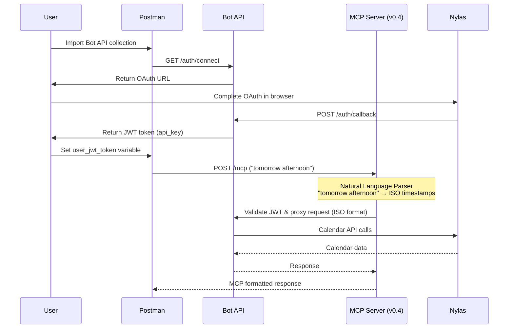

# Postman Collections for Nylas Applets

This directory contains comprehensive Postman collections for testing both the Bot API and Calendar MCP Server with **enhanced natural language date parsing** and OAuth authentication.

## Available Collections

### 🤖 Bot API Collection
- **File**: `Bot-API.postman_collection.json`
- **Purpose**: Full Bot API testing including OAuth flow and JWT token generation
- **Features**: Calendar operations, JWT management, health checks
- **Authentication**: Nylas API key + OAuth flow

### 📅 Calendar MCP Server Collection v0.4 🌟
- **File**: `Calendar-MCP-Server.postman_collection.json`
- **Purpose**: Test Calendar MCP server with **natural language date parsing** and OAuth authentication
- **✨ NEW FEATURES**:
  - 🗣️ **Natural Language Dates**: Say "tomorrow afternoon" or "next week" instead of ISO formats
  - 🎯 **Three Flexible Patterns**: Timeframe, Duration-based, and Precise control
  - 🧠 **Smart Boundary Inference**: Automatic time boundaries for expressions like "morning" or "week"
  - 🚫 **Zero LLM Hallucinations**: Server-side date parsing eliminates calculation errors
  - 🌍 **Automatic Timezone Detection**: Uses your calendar's timezone settings
- **Features**: All 7 MCP calendar actions + enhanced error scenarios
- **Authentication**: User JWT tokens from Bot API OAuth

## 🌟 Natural Language Date Parsing Examples

⚠️ **IMPORTANT - Valid vs Invalid Patterns:**
- ✅ **VALID**: "tomorrow at 2pm", "next Monday", "January 15th", "in 2 weeks", "Friday at 9 AM"
- ❌ **INVALID**: "work hours", "business hours", "lunch time" (use specific times instead)

### Pattern 1: Simple Timeframe (Recommended)
```json
{
  "timeframe": "tomorrow afternoon"    // Auto-infers 1pm-6pm
}
{
  "timeframe": "next week"             // Auto-infers Mon 9am - Fri 5pm
}
{
  "timeframe": "this Friday"           // Auto-infers Fri 9am - Fri 5pm
}
```

### Pattern 2: Duration-Based Scheduling
```json
{
  "start": "next Monday at 2pm",       // Natural language start
  "duration": "1 hour"                 // Server calculates end time
}
{
  "start": "tomorrow afternoon",
  "duration": "1h30m"                  // Flexible duration formats
}
```

### Pattern 3: Traditional Control (Legacy Compatible)
```json
{
  "start": "2025-06-09T14:00:00",     // ISO format still supported
  "end": "2025-06-09T15:00:00"
}
```

## Quick Start Guide

### Step 1: Set Up Bot API OAuth

1. **Import Bot API Collection**: Import `Bot-API.postman_collection.json`
2. **Set Environment**: Use Bot API local environment
3. **Complete OAuth**:
   - Run "Connect to Nylas (OAuth Start)" request  
   - Visit the returned URL in browser
   - Complete Google OAuth flow
   - **Copy the `api_key` from the callback response** - this is your JWT token

### Step 2: Configure Calendar MCP Server

1. **Import MCP Collection**: Import `Calendar-MCP-Server.postman_collection.json`
2. **Set Environment**: Import `Calendar-MCP-Server.postman_environment.json`
3. **Add Your JWT Token**:
   - Set `user_jwt_token` environment variable to the `api_key` from Step 1
   - This enables OAuth authentication for all MCP requests

### Step 3: Test Enhanced Natural Language Features 🎯

1. **Verify Setup**: Run "🔐 Authentication Setup" → "Bot API Health Check"
2. **Test MCP Server**: Run "🏥 Health & Status" → "MCP Server Health Check"  
3. **🌟 NEW: Test Natural Language**: Run "🗣️ Natural Language Examples" folder
   - Try "My Availability - Timeframe Pattern" with `"timeframe": "tomorrow afternoon"`
   - Try "Schedule Meeting - Start and End Times" with natural start + end times
   - Try "Find Mutual Slots - Next Week" with smart timeframe inference
4. **Test Traditional Methods**: Run "📅 Standard MCP Actions" for ISO format compatibility
5. **🧪 Test Enhanced Validation**: Run "🧪 Error Testing & Natural Language Validation"
   - Test ambiguous dates like `"sometime next"`
   - Test invalid durations like `"some time"`
   - Test missing required patterns

## 🔐 Authentication Endpoints

The Bot API now includes comprehensive authentication management:

### Core OAuth Flow
- **Start OAuth**: `GET /api/auth/connect/redirect` - Initiate OAuth flow
- **OAuth Callback**: `GET /api/auth/callback` - Complete OAuth, get JWT tokens
- **User Info**: `GET /api/auth/me` - Get current user info (requires JWT)

### ✨ New Token Management
- **🔄 Refresh Token**: `POST /api/auth/refresh` - Refresh expired access tokens
- **🚪 Logout**: `POST /api/auth/logout` - Clear authentication cookies

### Token Refresh Usage
```bash
# Option 1: Use cookies (automatic)
POST /api/auth/refresh
# Cookies contain refresh token automatically

# Option 2: Provide refresh token in body
POST /api/auth/refresh
Content-Type: application/json
{
  "refresh_token": "your_refresh_token_here"
}
```

**Response includes**:
- New `access_token` and `refresh_token`
- Token expiration info (`expires_in`, `token_type`)
- User details (`email`, `grant_id`, `provider`)

### Session Management
The Postman collection automatically:
- ✅ Saves tokens from OAuth callback to environment variables
- ✅ Updates refresh tokens when they rotate
- ✅ Provides logout functionality to clear all tokens

## Authentication Flow



## Environment Variables

### Calendar MCP Server Environments

Both local and production environments require:

| Variable | Description | Example |
|----------|-------------|---------|
| `mcp_base_url` | MCP server URL | `http://localhost:3002` |
| `bot_api_base_url` | Bot API URL | `http://localhost:3000` |
| `user_jwt_token` | JWT from OAuth | `eyJhbGci...` (from Bot API) |
| `request_id` | Auto-generated | Auto-populated |
| `event_id` | From schedule_meeting | Auto-populated |

### Getting Your JWT Token

**From Bot API Collection**:
1. Run "OAuth & Authentication" → "Connect to Nylas (OAuth Start)"
2. Complete OAuth flow in browser
3. Copy `api_key` from the response JSON
4. Set as `user_jwt_token` in Calendar MCP environment

**Example Response**:
```json
{
  "success": true,
  "data": {
    "grant_id": "grant_abc123",
    "api_key": "eyJhbGciOiJIUzI1NiIsInR5cCI6IkpXVCJ9...",
    "org_id": "your_org_id",
    "provider": "google"
  }
}
```

## Calendar MCP Server Actions (Enhanced v0.4)

### 📋 Available Tools with Natural Language Support

| Tool | Description | Enhanced Parameters |
|------|-------------|-------------------|
| **my_availability** | Get your calendar free-busy | `timeframe?` OR `start` + `end` + `durationMin?` + `timezone?` + `bufferMinutes?` |
| **contact_availability** | Get contact's availability | `email` + (`timeframe?` OR `start` + `end`) + `durationMin?` + `timezone?` + `bufferMinutes?` |
| **mutual_slots** | Find mutual availability | `emails[]` + (`timeframe?` OR `start` + `end`) + `durationMin` + `timezone?` + `bufferMinutes?` |
| **schedule_meeting** | Create meeting event | `emails[]` + `start` + `end` + `title` + `description?` + `timezone?` + `addSelf?` |
| **consecutive_slots** | Plan interview loops | `sessions[]` + (`timeframe?` OR `start` + `end`) + `gapMaxMin` + `timezone?` |
| **current_time** | Get current date/time | `timezone` |
| **user_info** | Get user information | `{}` (no parameters) |

### 🌟 Natural Language Expression Examples

| Expression | Smart Inference |
|------------|-----------------|
| `"tomorrow morning"` | Tomorrow 8am → Tomorrow 12pm |
| `"next week"` | Next Monday 9am → Next Friday 5pm |
| `"this Friday"` | This Friday 9am → This Friday 5pm |
| `"January 15th"` | Jan 15 9am → Jan 15 5pm |
| `"next Monday afternoon"` | Next Monday 1pm → Next Monday 6pm |
| `"tomorrow from 9am to 5pm"` | Explicit range preserved |
| `"in 2 weeks"` | Two weeks from today (business day) |

### 🕐 Duration Format Examples

| Duration Expression | Parsed Value |
|-------------------|--------------|
| `"1 hour"` | 60 minutes |
| `"30 minutes"` | 30 minutes |
| `"1h30m"` | 90 minutes |
| `"2 hours"` | 120 minutes |
| `"45min"` | 45 minutes |

### 🔐 Authentication Requirements

**All MCP requests require**:
- `Authorization: Bearer <user_jwt_token>` header
- Valid JWT token from Bot API OAuth flow
- Bot API and MCP server both running

### 🧪 Enhanced Testing Scenarios

**✅ Successful Natural Language Operations**:
- "Tomorrow afternoon" → Automatic 1pm-6pm inference
- "Next Monday at 2pm" + "1 hour" → Automatic end time calculation
- "Next week" → Automatic business week boundaries
- Smart timezone detection from calendar settings

**⚠️ Enhanced Error Testing**:
- Ambiguous natural language: `"sometime next"` → Helpful error with suggestions
- Invalid duration formats: `"some time"` → Duration parsing error with examples
- Missing required patterns → Clear validation messages
- Traditional error scenarios (401, 400, 502) still supported

## File Structure

```
postman/
├── README.md                                          # This file (updated v0.4)
├── Bot-API.postman_collection.json                    # Bot API with OAuth
├── Calendar-MCP-Server.postman_collection.json       # 🌟 Enhanced MCP server v0.4
├── Calendar-MCP-Server.postman_environment.json      # Local environment
└── Calendar-MCP-Server-Production.postman_environment.json  # Production env
```

## Development vs Production

### Local Development
- **Bot API**: `http://localhost:3000`
- **MCP Server**: `http://localhost:3002` (updated port)
- **OAuth**: Complete via localhost Bot API
- **JWT Duration**: 90 days default
- **🌟 Natural Language**: Full support with chrono-node parsing

### Production
- **Bot API**: `https://your-bot-api.vercel.app`
- **MCP Server**: `https://your-mcp-server.vercel.app`
- **OAuth**: Complete via production Bot API
- **JWT Duration**: Configurable via Bot API settings
- **🌟 Natural Language**: Same parsing capabilities in production

## Troubleshooting

### Common Issues

**401 Unauthorized**:
- Check `user_jwt_token` environment variable
- Ensure JWT token is valid (not expired)
- Verify Bot API is running and accessible

**404 Not Found**:
- Check `mcp_base_url` environment variable (updated to port 3002)
- Ensure MCP server is running on correct port
- Verify `/mcp` endpoint exists

**502 Bad Gateway**:
- Check Bot API connectivity from MCP server
- Verify `BOT_API_URL` environment variable in MCP server
- Check Bot API health endpoint

**🆕 Date Parse Errors**:
- **`date_parse_error`**: Use clearer expressions like "next week" vs "sometime next"
- **`duration_parse_error`**: Use formats like "1 hour", "30 minutes", "1h30m"
- **`invalid_params`**: Provide either `timeframe` OR both `start` and `end`

### Enhanced Testing Tips

1. **Start with Natural Language**: Try the "🗣️ Natural Language Examples" first
2. **Test Smart Inference**: Use expressions like "tomorrow afternoon" to see automatic boundaries
3. **Duration Patterns**: Try different duration formats in scheduling
4. **Error Validation**: Test ambiguous inputs to see helpful error messages
5. **Fallback to ISO**: Traditional ISO formats still work for precise control

### Getting Help

1. **Health Checks**: Always start with health check requests
2. **Environment Variables**: Verify all URLs and tokens are correct (port 3002 for MCP)
3. **Authentication**: Test with Bot API collection first to get valid JWT
4. **🌟 Natural Language Testing**: Use enhanced error scenarios to understand parsing capabilities
5. **Pattern Validation**: Try different input patterns to see flexibility

## Security Notes

- **JWT Tokens**: Keep tokens secure, they provide full calendar access
- **Environment Variables**: Use Postman's secret type for sensitive values
- **Multi-tenant**: Each user needs their own JWT token from OAuth
- **Token Revocation**: Tokens can be revoked via Bot API key management
- **🆕 Date Parsing**: All natural language parsing happens server-side for security

## What's New in v0.4

### 🎯 Major Enhancements
- **Natural Language Date Parsing**: Say "tomorrow afternoon" instead of calculating ISO dates
- **Three Flexible Patterns**: Timeframe, Duration-based, and Traditional control
- **Smart Boundary Inference**: Automatic time boundaries for natural expressions
- **🌟 LLM-Friendly Responses**: All unix timestamps converted to human-readable ISO format with timezone info
- **Zero LLM Hallucinations**: Server-side parsing eliminates date calculation errors
- **Enhanced Error Messages**: Helpful suggestions for ambiguous or invalid inputs
- **Duration Support**: Intuitive duration formats like "1h30m" and "2 hours"

### 🧪 Testing Improvements  
- **Natural Language Examples Section**: Dedicated folder showcasing new patterns
- **Enhanced Error Testing**: Specific tests for date/duration parsing validation
- **Clear Pattern Documentation**: Examples of all three input patterns
- **Backward Compatibility**: All traditional ISO formats still supported

---

**Last Updated**: January 2025  
**Compatible With**: Bot API v0.1.0, Calendar MCP Server v0.4.0 